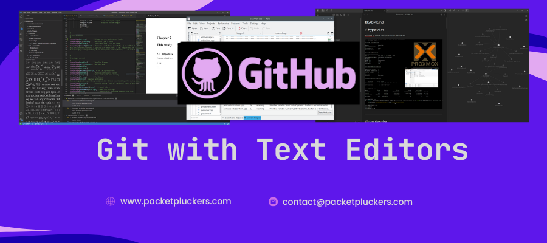

<p align="center">  </p> 

A guide for integrating Git with popular text editors like KATE and Obsidian.

> **Already have Git and GitHub set up?** Great! This guide shows you how to use Git with your favorite text editor.
>
> **New to Git?** Start with the [Quick Start Guide](Git%20Quickstart%20Guide.md) or [Complete Guide](Git%20with%20Github%20Guide.md) first.


---

## Table of Contents
- [Git with KATE](#git-with-kate)
- [Git with Obsidian](#git-with-obsidian)

---

## Git with KATE

KATE is just a text editor, so your workflow is:

1. Edit files in KATE
2. Save them
3. Open terminal in your project folder
4. Run git commands:

```bash
git add .
git commit -m "Update documentation"
git push
```

### Setting Up KATE's Built-in Terminal

**tip:** Open KATE's built-in terminal:

- KDE should have 'Konsole' preinstalled alongside KATE, but if it's not, just install it through the settings of KATE
- `Settings` then `Configure Kate` then `Plugins` then Enable `Terminal`
- To toggle press `F4`

### Daily KATE + Git Workflow

1. **Open your project in KATE**
   ```bash
   kate /path/to/your/project
   ```

2. **Make your edits** in KATE

3. **Save your files** (`Ctrl+S`)

4. **Open the terminal** in KATE (`F4`)

5. **Run Git commands**:
   ```bash
   # Check what changed
   git status
   
   # Stage your changes
   git add .
   
   # Commit with a message
   git commit -m "Updated documentation sections"
   
   # Push to GitHub
   git push
   ```

### Tips for KATE Users

- **Keep the terminal open**: Leave KATE's terminal panel open at the bottom for quick Git commands
- **Use keyboard shortcuts**: `F4` to toggle terminal, `Ctrl+S` to save
- **Multiple files**: KATE can handle multiple files/tabs - save all with `Ctrl+Shift+S` before committing
- **Session management**: KATE can save your sessions - useful for different projects

---

## Git with Obsidian

If you're tracking an Obsidian vault with Git:

### Initial Setup (First Time Only)

1. **Open terminal in your vault folder:**

```bash
cd ~/Documents/ObsidianVault
```

2. **Initialize Git:**

```bash
git init
git add .
git commit -m "Initial vault backup"
```

3. **Create GitHub repo and connect it:**

```bash
git remote add origin https://github.com/yourusername/obsidian-vault.git
git push -u origin main
```

### Daily Backup Routine

```bash
cd ~/Documents/ObsidianVault
git add .
git commit -m "Daily notes update"
git push
```

### Creating a .gitignore for Obsidian

**Pro tip:** Create a `.gitignore` file to exclude certain files:

```bash
nano .gitignore
```

Add:

```
.obsidian/workspace.json
.obsidian/workspace-mobile.json
.trash/
private/
```

**What this does:**
- `.obsidian/workspace.json` - Your personal workspace layout (changes constantly)
- `.obsidian/workspace-mobile.json` - Mobile workspace settings
- `.trash/` - Deleted notes in Obsidian's trash
- `private/` - Any folder you name "private" won't be tracked

### Obsidian + Git Workflow Options

#### Option 1: Manual Commits (Recommended for Beginners)

```bash
# At the end of your day/work session
cd ~/Documents/ObsidianVault
git add .
git commit -m "Notes from $(date +%Y-%m-%d)"
git push
```

#### Option 2: Create a Backup Script

Create a file called `backup-vault.sh`:

```bash
#!/bin/bash
cd ~/Documents/ObsidianVault
git add .
git commit -m "Auto backup: $(date '+%Y-%m-%d %H:%M:%S')"
git push
echo "Vault backed up successfully!"
```

Make it executable:

```bash
chmod +x backup-vault.sh
```

Run it whenever you want:

```bash
./backup-vault.sh
```

#### Option 3: Use Obsidian Git Plugin

Obsidian has a community plugin called "Obsidian Git" that automates this:

1. In Obsidian: `Settings` → `Community plugins` → `Browse`
2. Search for "Obsidian Git"
3. Install and enable it
4. Configure auto-commit interval in plugin settings

**Note:** You still need to set up Git manually first (Steps 1-3 above).

### Important Warnings for Obsidian Users

# **Warning:** Be careful about pushing personal notes to public repos!

**Consider:**
- Make your repo **Private** on GitHub if it contains personal notes
- Use the `.gitignore` to exclude sensitive folders
- Review what you're committing before pushing:
  ```bash
  git status  # See what will be committed
  git diff    # See exactly what changed
  ```

### Obsidian Multi-Device Sync with Git

If you use Obsidian on multiple devices:

**On Device 1 (after making changes):**
```bash
cd ~/Documents/ObsidianVault
git add .
git commit -m "Updated notes on laptop"
git push
```

**On Device 2 (before making changes):**
```bash
cd ~/Documents/ObsidianVault
git pull
```

**Best practice:** Always `git pull` before starting work on a different device!

### Troubleshooting Obsidian + Git

**Issue: "Your branch and 'origin/main' have diverged"**

This happens when you edited on multiple devices without pulling first.

**Solution:**
```bash
# Save your current work
git stash

# Get the latest from GitHub
git pull

# Reapply your changes
git stash pop

# Resolve any conflicts, then:
git add .
git commit -m "Merged changes from multiple devices"
git push
```

**Issue: Obsidian plugin not working**

Make sure:
1. Git is installed and configured
2. You've already run `git init` in your vault
3. You've set up a remote repository
4. You can manually push/pull successfully

**Issue: Too many automatic commits**

If using the Obsidian Git plugin:
- Adjust the auto-commit interval in plugin settings
- Consider manual commits instead for more meaningful commit messages

---

## Other Text Editors

### VS Code

VS Code has built-in Git integration:

1. Open your project folder in VS Code
2. Click the **Source Control** icon (left sidebar)
3. Stage changes by clicking `+` next to files
4. Write commit message in the box
5. Click the checkmark to commit
6. Click `...` → `Push` to push to GitHub

**Even easier:** Install the "GitLens" extension for advanced Git features.

### Vim/Neovim

For Vim users:

```bash
# Make changes in Vim
vim myfile.txt

# Exit Vim, then in terminal:
git add myfile.txt
git commit -m "Updated myfile"
git push
```

Or use plugins like `vim-fugitive` for Git integration inside Vim.

### Nano

```bash
# Edit in nano
nano myfile.txt

# Save (Ctrl+O), Exit (Ctrl+X)

# Then use Git commands:
git add myfile.txt
git commit -m "Updated myfile"
git push
```

---

## General Tips for Any Editor

### 1. Commit Often
Don't wait until the end of the day. Commit after:
- Completing a section
- Fixing a bug
- Adding a new feature
- Reaching a stable point

### 2. Write Meaningful Commit Messages
Instead of "updated files", use:
- "Added troubleshooting section to README"
- "Fixed typos in installation guide"
- "Reorganized folder structure"

### 3. Always Check Status First
Before committing:
```bash
git status  # See what changed
git diff    # See exact changes
```

### 4. Pull Before You Push
If working across devices:
```bash
git pull    # Get latest changes
# Make your edits
git add .
git commit -m "Your message"
git push
```

### 5. Its good practice to use .gitignore
Every project should have one. Common entries:
```
# System files
.DS_Store
Thumbs.db

# Editor files
.vscode/
.idea/
*~
*.swp

# Personal
TODO.md
NOTES.md
private/
```

---

## Quick Command Reference

```bash
# Check status
git status

# Stage all changes
git add .

# Stage specific file
git add filename.txt

# Commit
git commit -m "Your message here"

# Push to GitHub
git push

# Pull from GitHub
git pull

# View history
git log --oneline

# See what changed
git diff
```

---

## Need More Help?

- **Git basics**: See the [Quick Start Guide](Git%20Quickstart%20Guide.md)
- **Detailed explanations**: See the [Complete Guide](Git%20with%20Github%20Guide.md)
- **Troubleshooting**: See [Common Issues](Git%20with%20Github%20Guide.md#part-11-common-issues-and-solutions)

---
